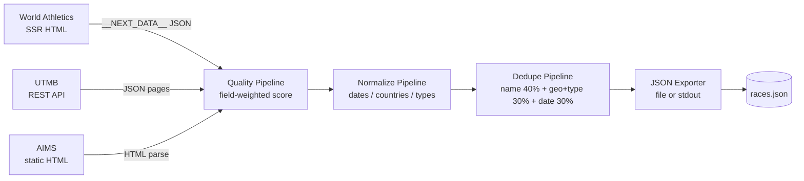

# race-scraper-toolkit

A modular toolkit for scraping endurance race calendars from public sources — three spiders, three techniques.

`race-scraper-toolkit` ships ready-to-run Scrapy spiders for **World Athletics**, **UTMB**, and **AIMS**, plus a four-stage pipeline (quality scoring → field normalization → confidence-weighted dedupe → JSON export). Everything runs in-memory; no database required.

## Architecture



## Quick start

```bash
pip install -e .
python -m racescraper worldathletics --year 2026 --output races.json
```

Output is a JSON array of event dicts ready for downstream tooling. See [`examples/output_worldathletics_sample.json`](examples/output_worldathletics_sample.json) for the shape.

Other commands:

```bash
python -m racescraper utmb --year 2026 --output utmb.json
python -m racescraper aims --output aims-supplements.json
python -m racescraper dedupe --input combined.json --output deduped.json
```

Run the standalone dedupe demo (no network required):

```bash
python examples/dedupe_demo.py
```

## Three scrapers, three techniques

| Source          | Technique                  | Why                                                          |
|-----------------|----------------------------|--------------------------------------------------------------|
| World Athletics | `__NEXT_DATA__` SSR JSON   | One HTTP request, no JS render needed                        |
| UTMB            | Public REST API            | Stable, fast, paginated (offset/limit)                       |
| AIMS            | HTML + supplement mode     | Doesn't create new events; backfills official URLs via dedup |

### Why three different approaches?

The endurance-race world has no canonical data source. Each platform has its own quirks, so each spider exploits whatever the source happens to expose:

* **World Athletics** is a Next.js app. The calendar page is server-rendered, meaning the entire event list is embedded in `<script id="__NEXT_DATA__">` as JSON. A single HTTP GET, one regex, and one `json.loads()` gets us the whole season — no headless browser, no DOM scraping, no rate-limit dance. This is the toolkit's signature trick and well worth knowing for any Next.js target.

* **UTMB** publishes a clean JSON API at `api.utmb.world/search/races` with `dateMin`/`dateMax`/`limit`/`offset`. We walk it in order and group races into events by name (`"Foo by UTMB - 100K"` and `"Foo by UTMB - 50K"` collapse into one event with two distances).

* **AIMS** is a sanctioning body, not a calendar — its data is sparse (name, date, location, official URL) but high-trust. Rather than litter the canonical catalog with low-coverage entries, we run AIMS in **supplement-only mode**: every item carries `_supplement_only=True`, and the dedupe step backfills `official_url` on already-known events. Items that don't match anything are dropped silently. This pattern is broadly useful for any authoritative-but-sparse secondary source.

## How confidence-weighted dedupe works

Three race calendars list the same race three different ways. To collapse them into one canonical event we score each pair on three axes and combine the scores with fixed weights:

| Component                       | Weight | Method                                      |
|---------------------------------|--------|---------------------------------------------|
| Name similarity                 | **40 %** | `rapidfuzz.fuzz.WRatio` (0..1)              |
| Same city *and* same event_type | **30 %** | Binary; 0.3 if both match, else 0           |
| Date proximity within ±7 days   | **30 %** | Linear decay: `1 - diff/7` inside window, else 0 |

The resulting `match_confidence` lives on `[0, 1]`. The cutoffs:

| Confidence | Action                                                          |
|------------|-----------------------------------------------------------------|
| `≥ 0.80`   | Auto-merge into the canonical event; backfill empty fields      |
| `0.60..0.80` | Probable match; keep both and flag `_needs_review=True`       |
| `< 0.60`   | Treat as a new canonical event (or drop if `_supplement_only`)  |

### Worked example: Tokyo Marathon

Two scrapers emit Tokyo Marathon items:

* **WA**: `name="Tokyo Marathon"`, `city="Tokyo"`, `event_type="marathon"`, `race_start_date="2026-03-01"`
* **UTMB-style**: `name="Tokyo Marathon 2026"`, same city, same type, same date

```
name_similarity   = WRatio("Tokyo Marathon", "Tokyo Marathon 2026") / 100
                  ≈ 0.95
geo_type_match    = (cities equal AND types equal) ? 1.0 : 0.0
                  = 1.0
date_proximity    = max(0, 1 - abs(0)/7)
                  = 1.0

score = 0.95 * 0.4 + 1.0 * 0.3 + 1.0 * 0.3
      = 0.38 + 0.30 + 0.30
      = 0.98
```

`0.98 ≥ 0.80` -> **auto-merge**. The WA item is treated as canonical; the UTMB-style item donates any fields the WA item is missing (e.g. `event_status`), and list fields like `tags` and `registration_urls` are unioned.

If a third item from AIMS arrives with `_supplement_only=True` and `official_url="https://www.marathon.tokyo/"`, the same merge logic backfills the `official_url` on the canonical — and if AIMS had instead emitted a race that no canonical matched, the supplement item would have been dropped instead of creating a noisy new event.

The original race-nexus implementation used PostgreSQL's `pg_trgm` extension for name similarity and a SQL JOIN to score candidates. This toolkit keeps the *same weighting* but swaps `pg_trgm` for `rapidfuzz` so dedupe runs in-memory on a single JSON dump — no database required.

## CLI

```
$ python -m racescraper --help

 Usage: python -m racescraper [OPTIONS] COMMAND [ARGS]...

 A modular toolkit for scraping endurance race calendars.

╭─ Commands ─────────────────────────────────────────────────────────────────╮
│ aims              Scrape AIMS — supplement mode.                           │
│ dedupe            Run confidence-weighted dedupe over an existing JSON.    │
│ utmb              Scrape the UTMB public race-search API.                  │
│ worldathletics    Scrape the World Athletics Label Road Races calendar.    │
╰────────────────────────────────────────────────────────────────────────────╯
```

Per-command flags:

```bash
python -m racescraper worldathletics --year 2026 --output races.json [--limit N]
python -m racescraper utmb           --year 2026 --output races.json [--limit N]
python -m racescraper aims                       --output supplements.json [--limit N]
python -m racescraper dedupe         --input combined.json --output deduped.json
```

## Use cases

* **Race aggregators** — build a unified calendar from three or more public sources without writing every spider from scratch.
* **Running / endurance platforms** — keep an internal race catalog fresh on a schedule.
* **Endurance analytics & research** — collect structured event data (with distance, elevation, status) for trends or planning.
* **Personal training tools** — power a "what's coming up near me" feed.

## Project layout

```
race-scraper-toolkit/
├── racescraper/
│   ├── cli.py                       Typer CLI entry point
│   ├── models.py                    Pydantic v2 Event/Distance schema
│   ├── settings.py                  Scrapy settings (no DB)
│   ├── spiders/
│   │   ├── base.py                  BaseRaceSpider + RawEventItem
│   │   ├── worldathletics.py        __NEXT_DATA__ SSR JSON
│   │   ├── utmb.py                  REST API walker
│   │   └── aims.py                  HTML, supplement-only
│   └── pipelines/
│       ├── quality.py               field-weighted scoring
│       ├── normalize.py             dates / countries / event_type
│       ├── dedupe.py                rapidfuzz + 40/30/30 weighting
│       └── exporter.py              JSON to file or stdout
├── examples/
│   ├── output_worldathletics_sample.json   10 sample races
│   └── dedupe_demo.py                       30 raw -> ~25 canonical
└── tests/
    ├── test_dedupe.py                       weighting + supplement behavior
    └── test_normalize.py                    country / type / status
```

## Development

```bash
pip install -e ".[dev]"
pytest
```

## Where this came from

This toolkit was extracted from **race-nexus**, a private platform that aggregates ~300 events from these three sources (World Athletics + UTMB + AIMS) into a unified canonical catalog. The proprietary side handles JWT-authenticated user accounts, race calendars, registration tracking, lottery alerts, and a Next.js portal — none of which are in scope here.

What's open-sourced is the part that does the heavy lifting on the data side: three battle-tested spiders, the quality/normalize/dedupe pipeline, and a CLI that ties them together. If you're building anything that needs structured endurance-race data, this is a good starting point.

## License

MIT — see [`LICENSE`](LICENSE).
